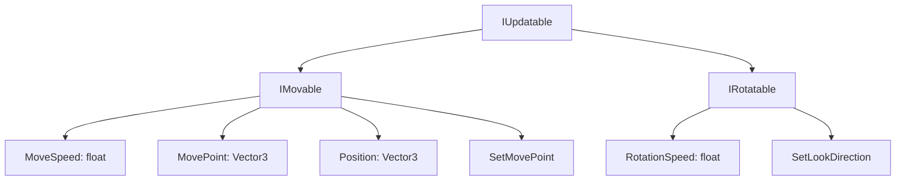
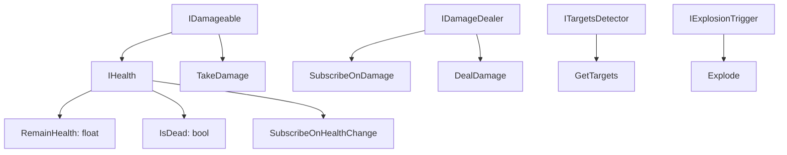

# 🎮 Система навигации и боевой механики

## 🎯 Обзор изменений

Добавлена полноценная система навигации с боевой механикой для персонажей, включая перемещение по клику, систему здоровья, урона и мины с взрывами.

### 🏗️ Новая архитектура

Реализована модульная структура с чётким разделением ответственности:

```
📦 Navigation/
├── 🚶 Movement/
│   ├── 🎮 Controllers/
│   │   ├── ControllerBase
│   │   ├── MoveController
│   │   └── PointClickController
│   ├── 🔄 Manipulators/
│   │   ├── NavMeshAgentMover
│   │   ├── DirectionRotator
│   │   ├── AlongMoverDirectionRotator
│   │   └── CompositeManipulator
│   └── 🔌 Interfaces/
│       ├── IMovable
│       ├── IRotatable
│       └── IMovePointSubscriber
├── ⚔️ Damage/
│   ├── 💣 Behaviours/
│   │   ├── Health
│   │   ├── Mine
│   │   └── DestroyOnDie
│   ├── 🔥 DamageDealers/
│   │   ├── DamageDealer
│   │   └── SphereTargetsDetector
│   └── 🔌 Interfaces/
│       ├── IDamageable
│       ├── IHealth
│       ├── IDamageDealer
│       ├── ITargetsDetector
│       └── IExplosionTrigger
├── ✨ FX/
│   └── Behaviours/
│       ├── CharacterView
│       └── NavigationEffectSpawner
└── 🔧 Common/
    ├── Controllers/
    │   └── DeathController
    └── Interfaces/
        ├── IUpdatable
        ├── IEventBroadcaster
        └── IEventSubscriber
```

### 🔑 Ключевые интерфейсы

#### Движение и вращение


#### Система урона


### 🎮 Основная функциональность

#### 🚶 Система навигации
- **PointClickController**: Управление перемещением по кликам мыши
- **NavMeshAgentMover**: Интеграция с Unity NavMesh
- **DirectionRotator**: Автоматическое вращение персонажа в направлении движения
- **CompositeManipulator**: Объединение нескольких манипуляторов

#### ⚔️ Боевая система
- **Health**: Компонент здоровья с подпиской на изменения
- **DamageDealer**: Обработка нанесения урона
- **SphereTargetsDetector**: Поиск целей в радиусе взрыва
- **Mine**: Мины с задержкой взрыва и AoE уроном

#### 🎭 Визуальные эффекты
- **CharacterView**: Управление анимациями (бег, ранение, смерть)
- **NavigationEffectSpawner**: Спавн визуальных эффектов при перемещении
- **BoomLight**: Анимация взрыва с изменением интенсивности света

### 🔄 Паттерны проектирования

1. **🧩 Композиция вместо наследования** - использование `CompositeManipulator`
2. **📢 Publisher-Subscriber** - подписка на изменения здоровья и события урона
3. **⚡ Event-Driven** - автоматическое отключение контроллеров при смерти
4. **🔌 Dependency Injection** - внедрение зависимостей через конструкторы

### 🎯 Новые возможности

- ✅ Перемещение персонажа по клику на NavMesh
- ✅ Система здоровья с визуализацией
- ✅ Мины с задержкой взрыва и уроном по области
- ✅ Анимационные состояния (бег, получение урона, смерть)
- ✅ Визуальные эффекты при перемещении и взрывах
- ✅ Автоматическое управление состоянием персонажа
- ✅ Масштабируемая архитектура с интерфейсами

### 🧪 Тестирование

Все компоненты используют интерфейсы, что обеспечивает:
- 🔧 Лёгкое модульное тестирование
- 🔄 Возможность подмены зависимостей
- 📈 Масштабируемость системы

### 📦 Зависимости

- Unity 2022.3.16f1
- Universal Render Pipeline (URP)
- Unity NavMesh системы
- Standard Assets для анимаций

Этот PR создаёт прочную основу для дальнейшего развития игровой системы с чистой архитектурой и возможностью лёгкого расширения функциональности.